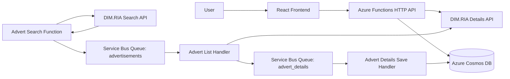
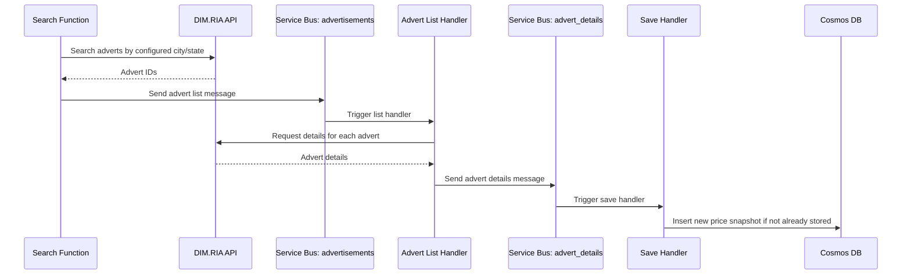

# DIM.RIA Advert Price Tracker

DIM.RIA Advert Price Tracker is a small full-stack application for monitoring real estate advertisements from DIM.RIA.

The backend is implemented with **Python Azure Functions**. It searches advertisements through the DIM.RIA API, sends advert IDs through **Azure Service Bus**, loads detailed advert data, stores price snapshots in **Azure Cosmos DB**, and exposes HTTP endpoints for the frontend.

The frontend is a **React + TypeScript** application that displays collected adverts, cities, price history, and advert details.

## Repository Description

> Azure Functions and React application for collecting DIM.RIA real estate adverts, tracking price changes in Cosmos DB, and displaying advert statistics through a web UI.

## Main Features

- Search real estate adverts from the DIM.RIA API.
- Collect advert IDs for configured Ukrainian cities/locations.
- Process advert lists asynchronously through Azure Service Bus.
- Load detailed advert information from DIM.RIA.
- Store advert price snapshots in Azure Cosmos DB.
- Detect price movement direction for each advert.
- Expose HTTP API endpoints for adverts, advert details, and cities.
- Display advert statistics in a React TypeScript frontend.
- Deploy frontend through Azure Static Web Apps.

## Technology Stack

### Backend

- Python
- Azure Functions
- Azure Service Bus
- Azure Cosmos DB
- Pydantic
- Requests
- Azure Functions Extension Bundle
- Application Insights logging support

### Frontend

- React 18
- TypeScript
- Redux Toolkit
- React Redux
- Redux Saga
- Axios
- UI5 Web Components for React
- Azure Static Web Apps

## High-Level Architecture



## Backend Workflow



## Backend Components

### `function_app.py`

Main Azure Functions entry point.

Responsibilities:

- Defines Service Bus queue trigger for advert list processing.
- Defines Service Bus queue trigger for advert details saving.
- Defines HTTP endpoint for advert statistics.
- Defines HTTP endpoint for live advert details.
- Defines HTTP endpoint for configured cities.

Main HTTP endpoints:

| Method | Route | Purpose |
|---|---|---|
| `GET` | `/api/get_advertisements/{cityId}` | Returns advert statistics and price history. |
| `GET` | `/api/get_advert_details/{id}` | Returns detailed data for a specific advert. |
| `GET` | `/api/get_cities` | Returns configured cities. |

Main queue handlers:

| Queue | Function | Purpose |
|---|---|---|
| `advertisements` | `adverts_list_message_handler` | Reads advert IDs, loads details, sends detail messages. |
| `advert_details` | `advert_details_save_db` | Saves advert detail snapshots into Cosmos DB. |

### `dimria/dimria_requests.py`

Contains DIM.RIA API request logic.

Responsibilities:

- Build DIM.RIA search URLs.
- Search adverts for configured city/state pairs.
- Load advert details by advert ID.
- Return configured city list.

### `dimria/service_bus.py`

Contains Azure Service Bus sender logic.

Responsibilities:

- Send advert list messages to the advertisements queue.
- Send advert detail messages to the advert details queue.

### `dimria/cosmos_db.py`

Contains Cosmos DB access logic.

Responsibilities:

- Connect to Cosmos DB.
- Check whether advert price snapshot already exists.
- Insert new advert price snapshot.
- Query all adverts.
- Query adverts by city.

### `dimria/requests_handle.py`

Contains higher-level request and aggregation logic.

Responsibilities:

- Read advert snapshots from Cosmos DB.
- Group snapshots by advert ID.
- Build price history per advert.
- Determine price direction:
  - `1` — price increased
  - `-1` — price decreased
  - `0` — price unchanged

## Frontend Components

The frontend is located in:

```text
dimria-fe/
```

Important parts:

| Path | Purpose |
|---|---|
| `dimria-fe/package.json` | Frontend dependencies and npm scripts. |
| `dimria-fe/src/App.tsx` | Main React application entry point. |
| `dimria-fe/src/redux/adverts/requests.ts` | Axios API calls to the backend. |
| `dimria-fe/src/redux/adverts/` | Redux state, side effects, selectors, and advert-related logic. |
| `dimria-fe/src/Components/` | UI components. |

## Data Flow

1. The search process calls the DIM.RIA search API for configured locations.
2. It receives advert IDs.
3. Advert IDs are published to the `advertisements` Service Bus queue.
4. The advert list queue handler receives the message.
5. For each advert ID, it calls the DIM.RIA details API.
6. Detailed advert data is sent to the `advert_details` queue.
7. The detail queue handler receives the message.
8. The advert is stored in Cosmos DB if the same `advert_id + price` snapshot does not already exist.
9. The frontend calls HTTP endpoints to display advert statistics and details.

## Cosmos DB Document Shape

The stored advert snapshot contains fields similar to:

```json
{
  "id": "generated-guid",
  "advert_id": 123456,
  "city_name": "Житомир",
  "state_id": 2,
  "city_id": 2,
  "currency_type_id": 1,
  "price": 50000,
  "rooms_count": 2,
  "currency_type_uk": "$",
  "created_at": "2026-05-29 12:00:00"
}
```

## Required Environment Variables

Backend environment variables:

| Variable | Purpose |
|---|---|
| `DIMRIA_API_KEY` | API key for DIM.RIA Developers API. |
| `SERVICE_BUS_CONNECTION_STRING_SEND` | Azure Service Bus connection string for sending messages. |
| `SERVICE_BUS_CONNECTION_STRING_SEND_LISTEN` | Azure Functions Service Bus trigger connection string. |
| `ADVERTSLIST_QUEUE_NAME` | Queue name for advert list messages. |
| `ADVERTDETAILS_QUEUE_NAME` | Queue name for advert detail messages. |
| `COSMOS_ACCOUNT_HOST` | Cosmos DB account endpoint. |
| `COSMOS_MASTER_KEY` | Cosmos DB access key. |
| `COSMOS_DB_ID` | Cosmos DB database ID. |
| `COSMOS_CONTAINER_ID` | Cosmos DB container ID. |
| `AzureWebJobsStorage` | Azure Functions runtime storage connection string. |

Example `local.settings.json`:

```json
{
  "IsEncrypted": false,
  "Values": {
    "AzureWebJobsStorage": "UseDevelopmentStorage=true",
    "FUNCTIONS_WORKER_RUNTIME": "python",

    "DIMRIA_API_KEY": "your-dimria-api-key",

    "SERVICE_BUS_CONNECTION_STRING_SEND": "Endpoint=sb://...",
    "SERVICE_BUS_CONNECTION_STRING_SEND_LISTEN": "Endpoint=sb://...",
    "ADVERTSLIST_QUEUE_NAME": "advertisements",
    "ADVERTDETAILS_QUEUE_NAME": "advert_details",

    "COSMOS_ACCOUNT_HOST": "https://your-account.documents.azure.com:443/",
    "COSMOS_MASTER_KEY": "your-cosmos-key",
    "COSMOS_DB_ID": "dimria",
    "COSMOS_CONTAINER_ID": "adverts"
  }
}
```

Do not commit real keys or connection strings.

## Local Backend Setup

### 1. Create virtual environment

```bash
python -m venv .venv
```

Activate it:

```bash
# Linux/macOS
source .venv/bin/activate
```

```powershell
# Windows PowerShell
.\.venv\Scripts\Activate.ps1
```

### 2. Install dependencies

```bash
pip install -r requirements.txt
```

### 3. Configure local settings

Create `local.settings.json` in the repository root and fill required values.

### 4. Start Azure Functions locally

```bash
func start
```

Expected local API base URL:

```text
http://localhost:7071/api
```

## Local Frontend Setup

```bash
cd dimria-fe
npm install
npm start
```

Build production version:

```bash
npm run build
```

Run tests:

```bash
npm test
```

## API Endpoints

### Get advert statistics

```http
GET /api/get_advertisements/{cityId}
```

Use `-1` to request all cities.

Example:

```http
GET /api/get_advertisements/-1
```

### Get advert details

```http
GET /api/get_advert_details/{id}
```

Example:

```http
GET /api/get_advert_details/123456
```

### Get cities

```http
GET /api/get_cities
```

## Deployment

### Backend

The backend is designed to run as an Azure Functions application.

Recommended Azure resources:

- Azure Functions App
- Azure Storage Account
- Azure Service Bus Namespace
- Two Service Bus queues:
  - `advertisements`
  - `advert_details`
- Azure Cosmos DB account
- Application Insights

### Frontend

The frontend is deployed with Azure Static Web Apps.

The GitHub Actions workflow builds and deploys the React app from:

```text
/dimria-fe/
```

The frontend build output folder is:

```text
build
```

## License

No license file is currently documented in this README. Add a `LICENSE` file if the project should be distributed publicly.
